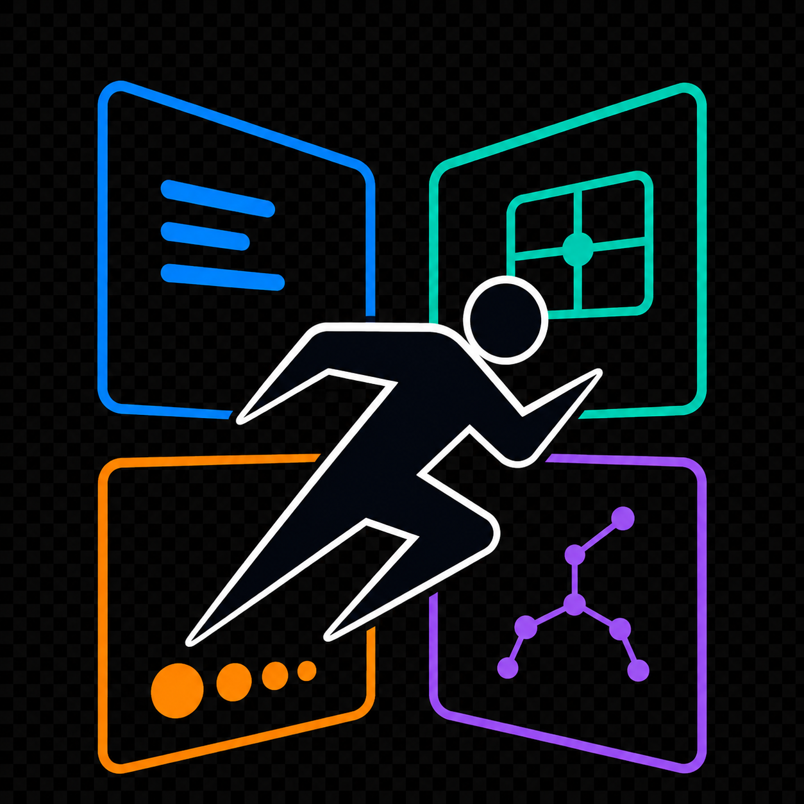

<div align="center">



# ArtButSports

**Find the artwork inside any image.**

Drop in a sports photograph — or any frame — and surface visually resonant CC0 artworks from the [Cleveland Museum of Art](https://www.clevelandart.org/open-access) open collection.

Inspired by [@artbutmakeitsports](https://www.instagram.com/artbutmakeitsports/) on Instagram.

[](https://artbutsports.vercel.app)
[](https://nextjs.org)
[](https://fastapi.tiangolo.com)
[](https://pytorch.org)

</div>

---

## Overview

ArtButSports is a local-first visual search app that matches your image against ~20,000 public-domain artworks. Instead of relying on a single embedding, it blends four independent signals — semantics, composition, color, and pose — with adjustable weights so you can steer results toward what matters most.

Upload a photo, tune the sliders, and browse a ranked masonry grid of museum works with per-signal score breakdowns.

<p align="center">
  
</p>

## Features

- **Multi-signal matching** — Gemini embeddings, saliency/edge composition, LAB/palette color descriptors, and YOLO pose similarity, combined with calibrated weighting
- **Interactive weight controls** — Enable or disable each signal and rebalance sub-features in real time
- **Demo gallery** — Try the app instantly with curated sample sports frames
- **Infinite scroll results** — Paginated ranking across the full corpus with score transparency on every card
- **Feature visualization** — Explore how each signal transforms an image on the `/visualize` page
- **Privacy-first** — Uploaded images are processed in memory and never stored

## How it works

Every query runs the same four-stage pipeline. Each stage produces a fixed descriptor that is compared against a precomputed feature table.

| Signal | What it captures | Models & methods |
| --- | --- | --- |
| **Semantics** | Subject, mood, and scene as a whole | Gemini `gemini-embedding-2` (3072-dim vector) |
| **Composition** | Visual weight and frame structure | MobileNet saliency grid + edge-orientation histogram |
| **Color** | Palette, temperature, and contrast | LAB histograms, quantized palette, warm/cool balance |
| **Pose** | Body configuration (when a person is detected) | YOLO pose keypoints → joint-angle descriptors |

The corpus feature table (`data/features/artbutsports_features.npz`) holds precomputed vectors for **19,996** CC0 works spanning prints, paintings, drawings, sculpture, and photography across 12 museum departments.

## Tech stack

| Layer | Stack |
| --- | --- |
| **Frontend** | Next.js 15, React 19, Tailwind CSS, Radix UI |
| **Backend** | FastAPI, Python 3.13, uv |
| **ML / CV** | PyTorch, torchvision, Ultralytics YOLO, Google Gemini API, OpenCV, Grad-CAM |
| **Deployment** | Vercel (frontend) + GCP VM (backend) |

## Project structure

```text
ArtButSports/
├── frontend/          # Next.js app (query + visualize pages)
├── backend/           # FastAPI API, feature extraction, scoring
├── scripts/           # Feature table builder, VM image setup
├── data/              # Metadata CSV, feature table, corpus images
└── docs/              # GCP deployment and feature analysis notes
```

## Local development

### Prerequisites

- Python 3.13 with [uv](https://docs.astral.sh/uv/)
- Node.js 20+
- A `GEMINI_API_KEY` for live query embeddings
- The feature table at `data/features/artbutsports_features.npz` (build with `scripts/build_features.py`)

### Backend

```bash
# From the repo root — create .env with GEMINI_API_KEY and data paths
uv sync
uv run fastapi run backend/api/app.py --host 0.0.0.0 --port 8000
```

### Frontend

```bash
cd frontend
npm install
npm run dev
```

Open [http://localhost:3000](http://localhost:3000). The frontend expects the API at `http://localhost:8000` by default (`NEXT_PUBLIC_API_BASE_URL`).

## Documentation

- [GCP VM backend setup](docs/GCP_VM_SETUP.md) — deploy the API on a Google Cloud VM with Caddy
- [Feature table analysis](docs/FEATURE_TABLE_ANALYSIS.md) — corpus coverage, calibration, and completeness stats

## License & attribution

Artworks shown in results are **CC0 public-domain works** from the [Cleveland Museum of Art Open Access collection](https://www.clevelandart.org/open-access).

Built by [Arjun Sahlot](https://github.com/ArjunSahlot).
